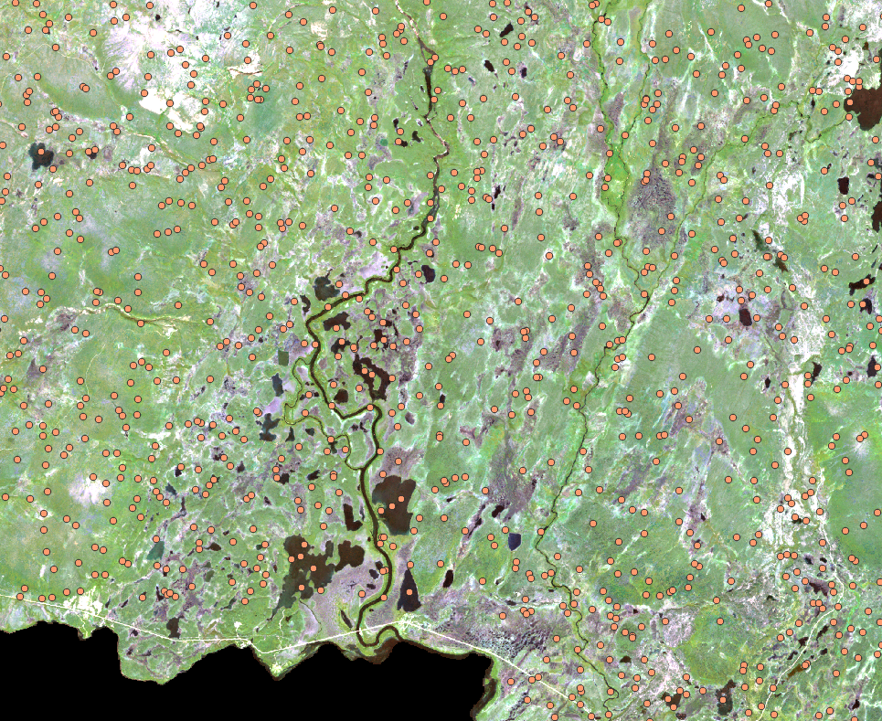
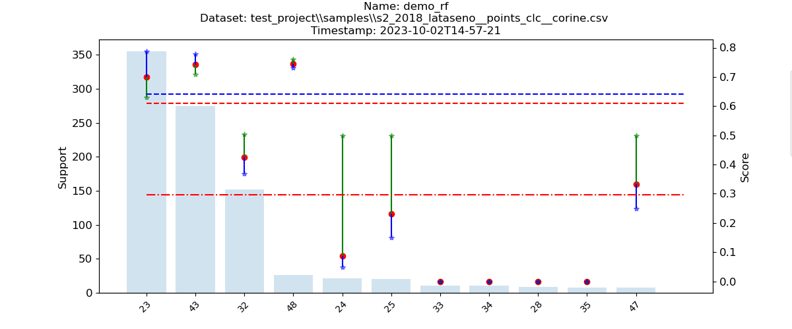
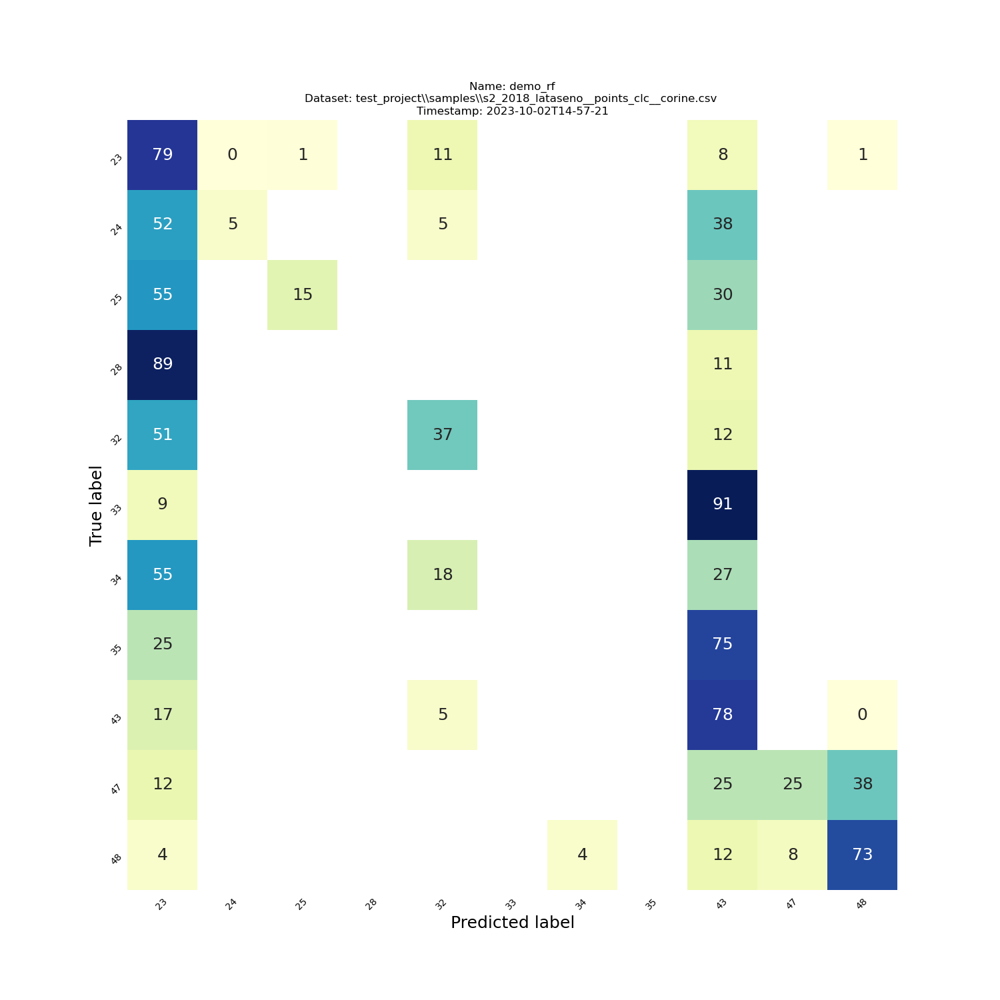
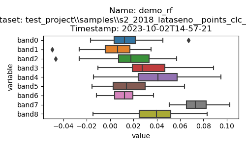
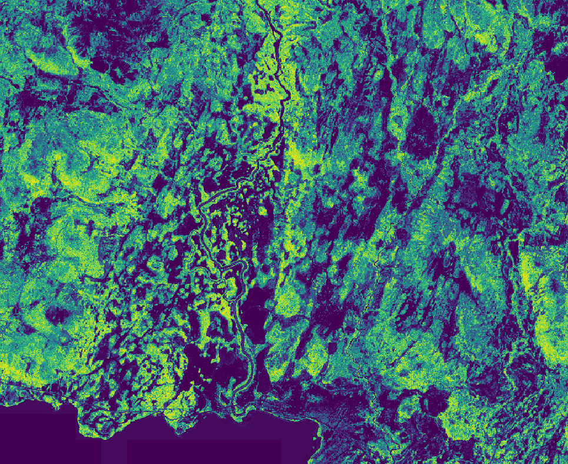
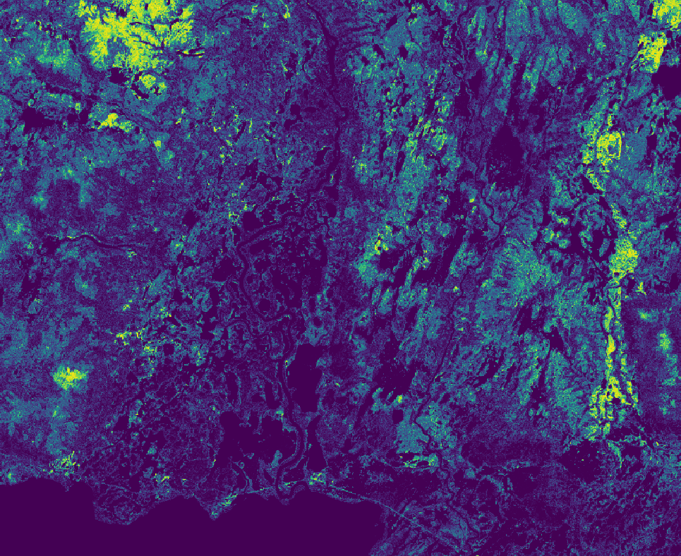
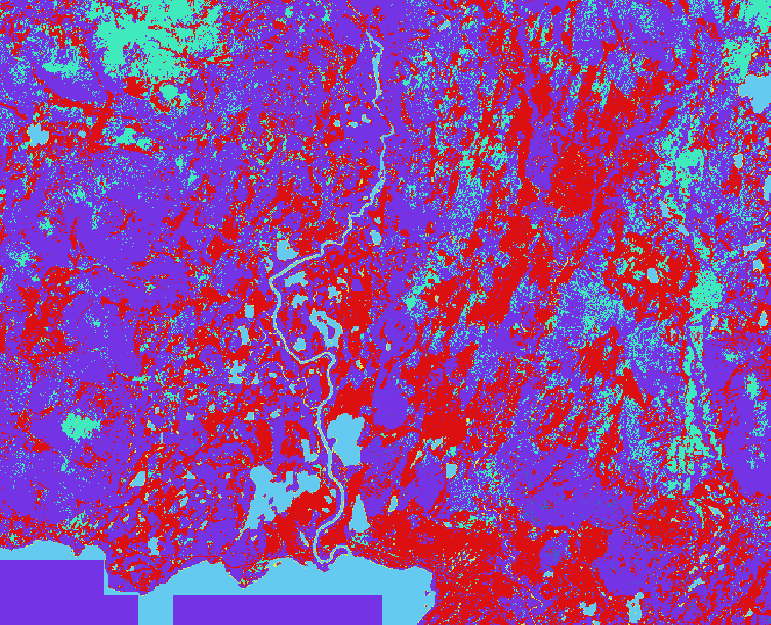

# point-eo demo


To install the environment and the package, follow the installation instructions in the [README](../README.md) and activate the conda environment

```
conda activate point-eo
```

The scripts in this demo are formatted to the Anaconda Prompt (CMD) on Windows. They also work in PowerShell and UNIX command lines similarly, but the break character needs to be changed to backtick (`` ` ``) in PowerShell, backslash (`` \ ``) in UNIX.

In this demo, we use the data in the [data](../data/) directory. It consists of georeferenced points `points_clc.geojson` that have a single value `corine`, corresponding to the CLC class in this point. This value could be any class from any source, for example field measurements etc.

The raster `s2_2018_lataseno.tif` is a geotiff with 9 bands from Sentinel 2.




## 01. Sampling data from a raster:


The `sample_raster` command samples points from a raster, saving a chosen value (here `corine`, corresponding to the CLC class) and the raster values in that point to a table.

```cmd
point-eo sample_raster ^
    --input data\\points_clc.geojson ^
    --input_raster data\\s2_2018_lataseno.tif ^
    --target corine ^
    --out_folder test_project\\samples
```

This produces a table of form

| variable | band0 | band1 |
|------------|-------|-------|
| class A    | 123   | 67.7  |
| class B    | 456   | 23.3  |

to a `.csv` and `.geojson` file in the `--out_folder`

If you want to specify the channel names in the raster, you can pass a `.txt`-file to the `--band_names` argument. The file should have each band name on their own row:

```bash
#bandnames.txt
height
NDVI
```

This would result in a table
| variable   | height| NDVI |
|------------|-------|-------|
| class A    | 123   | 67.7  |
| class B    | 456   | 23.3  |

With the parameter `--shp`, output is a shapefile instead of geojson.

See `point-eo sample_raster --help` for all parameters.

## 02. Training a Random Forest model for the sampled points

The `analysis` -command fits a Random Forest to the data, and evaluates the model with cross-validation.

```cmd
point-eo analysis ^
    --input test_project\\samples\\s2_2018_lataseno__points_clc__corine.csv ^
    --out_prefix demo_rf ^
    --out_folder test_project\\analysis ^
    --separator , ^
    --decimal . ^
    --remove_classes_smaller_than 6
```

Evaluation metrics are printed to the command line, as well as to a log file in the output directory. Evaluation graphs are saved (confusion matrx, class accuracies, channel permutation importances). Permutation importance tells how important the different channels are to the final classification.

The fonts of the output graphs can be changed with the parameters

```cmd
--confusion_matrix_fonts "22,20,20"
--classification_report_fonts "22,20,20"
```

This script produces a `.pkl` file that contains the model. This is used in the final raster classification.

If your dataset has a lot of classes, the output rasters can be very large, as they have as many channels as your training data has classes. You can reduce the number of classes by removing classes that have less than X samples with the parameter `--remove_classes_smaller_than X`.

With our test dataset the graphs look like this:





See `point-eo analysis --help` for all parameters.

# 02. AutoML

A more thorough approach for finding a model can be done with the TPOT AutoML library, which finds and tunes a model configuration with generic algorithms

```cmd
point-eo tpot_train ^
    --input test_project\\samples\\s2_2018_lataseno__points_clc__corine.csv ^
    --out_prefix tpot_demo ^
    --out_folder test_project\\tpot_out_test ^
    --generations 2 ^
    --population_size 10 ^
    --scoring f1_weighted
```

Set the genrations and population size as high as your computer budget allows. Finding the model can take a long time, and it's not guaranteed that it performs better than a plain random forest.

See `point-eo tpot_train --help` for all parameters.

## Evaluating an AutoML-model and saving it

To produce a `pkl` file and evaluation figures, pass the TPOT model output to the `analysis` -script:

point-eo analysis ^
    --input test_project\\samples\\s2_2018_lataseno__points_clc__corine.csv ^
    --out_prefix tpot_demo ^
    --out_folder tpot_analysis ^
    --tpot_model test_project\\tpot_out_test\\tpot_demo_acc0.6362_230605T201346.py  ^
    --separator , ^
    --decimal . ^
    --remove_classes_smaller_than 6

# 03. Raster classification

Classifying the entire raster is done with the `predict` command

```cmd
point-eo predict ^
    --model test_project\\analysis\\demo_rf__s2_2018_lataseno__points_clc__corine__2023-10-13T10-51-44_model.pkl ^
    --input_raster data\\s2_2018_lataseno.tif ^
    --cell_size 3000 ^
    --cell_buffer 2 ^
    --out_folder test_project\\predictions
```

If your raster is not rectangular, it is adviced to pass a geometry file to the `--extent` parameter. This way the only areas in the geometry are calculated, saving time.

```cmd
point-eo predict ^
    --model test_project\\analysis\\demo_rf__s2_2018_lataseno__points_clc__corine__2023-10-13T10-51-44_model.pkl ^
    --input_raster data\\s2_2018_lataseno.tif ^
    --cell_size 3000 ^
    --cell_buffer 2 ^
    --out_folder test_project\\predictions_extent ^
    --extent data\\demo_extent.shp
```

See `point-eo predict --help` for all parameters.

The output is saved as patches to the `--out_folder`. The virtual raster can be changed to a normal raster with GDAL. You have to change the `gdal_merge.py` path to the path on your system.
```cmd
python C:\\Users\\E1007914\\AppData\\Local\\miniconda3\\envs\\point-eo\\Scripts\\gdal_merge.py ^
-o test_project\\predictions\\demo.tif ^
-co "COMPRESS=LZW" ^
-co "BIGTIFF=YES" ^
-co "TILED=YES" ^
-ot "UInt16" ^
test_project\\predictions\\s2_2018_lataseno__demo_rf__s2_2018_lataseno__points_clc__corine__2023-10-02T14-57-21_model_C.vrt
```

The prediction output is a raster with the (uncalibrated) class probabilities of the classifier. So if your dataset has N classes, the output raster has N channels. For example, the channel for CLC class 23 (broad-leaved forests) looks like this:



and CLC class 32 (sparsely vegetated areas) looks like this:



## Postprocessing
Raster channels can be renamed from the class map that was created with the `analysis` -command:
```cmd
point-eo set_band_description ^
    --input_raster test_project\\predictions\\demo.tif ^
    --label_map test_project\\analysis\\demo_rf__s2_2018_lataseno__points_clc__corine__2023-10-02T14-57-21_label_map.txt
```

Finally, we can calculate two single-channel rasters: the most probable class, and it's confidence with the command

```cmd
point-eo postprocess_prediction ^
    --input_raster test_project\\predictions\\demo.tif ^
    --out_folder test_project\\predictions ^
    --label_map test_project\\analysis\\demo_rf__s2_2018_lataseno__points_clc__corine__2023-10-02T14-57-21_label_map.txt
```

The files are named `demo_S.tif` for the classification and `demo_M.tif` for the maximum confidence raster.

Final classification with paletted values corresponding to the most probable class:



With quality source rasters and a well-curated class taxonomy, Random Forest classifiers can perform very well. 